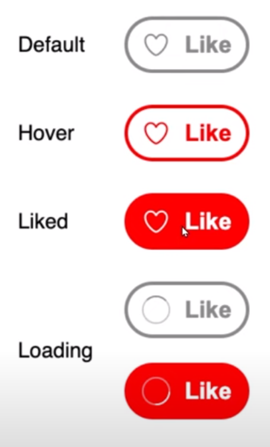

# Like Button 
This React Like Button component features four states: default, hover, liked, and loading. The button undergoes various transitions based on user interactions and API calls.

## States
### 1. Default State
- The initial state of the button.
- On click, triggers an API call and transitions to the loading state.

### 2. Hover State
- Active when the user hovers over the button.
- Provides a visual indication of interactivity.

### 3. Liked State
- Indicates that the user has liked the content.
- On click, transitions to the loading state.

### 4. Loading State
- Represents an ongoing API call.

## Preview


## Installation
- Pull this branch into your local system.
- Make sure you have Node installed (preferrably Node v18.17.1).
- Navigate to the project directory and run 
  ```
  npm install
  ```
- Once all the dependencies have been installed, run the following command to start the dev server.
  ```
  npm run dev
  ```